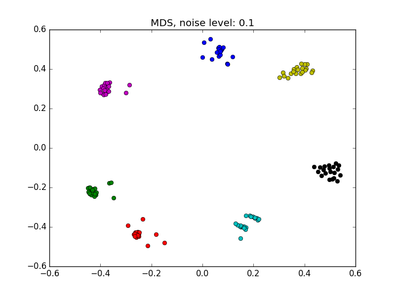
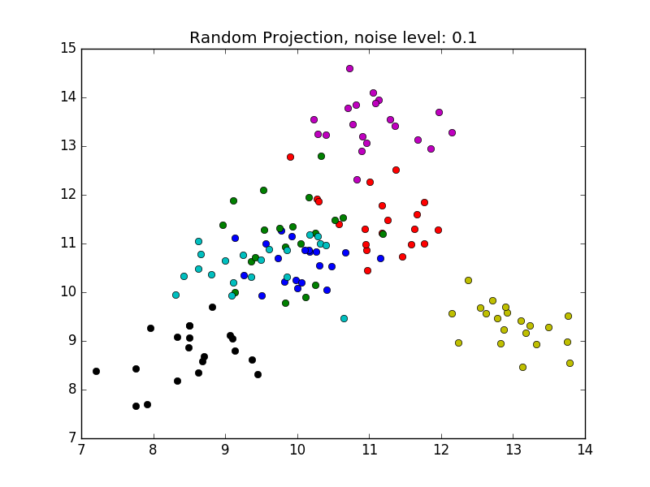
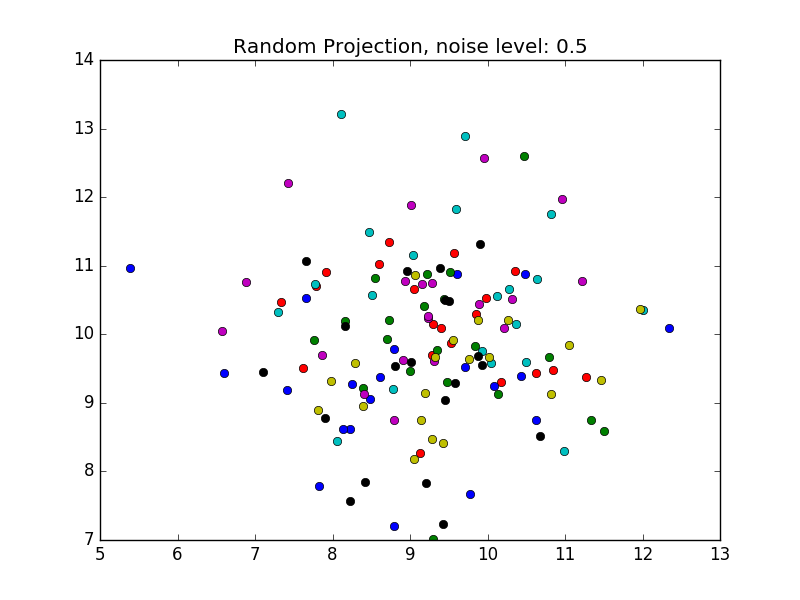

# Visualizing SDR clusters with Multidimensional Scaling

This demo script shows that MDS can be used to visualize high dimensional
sparse distributed representations (SDRs).

The MDS algorithm is a widely used information visualization technique that
takes pair-wise distance between a set of high-dimensional data points as input.
The algorithm places these data points in a low-dimensional space such that
the distance is preserved as well as possible.

We created 7 SDR clusters. The SDRs within each cluster are created by adding
varying amount of sparse noise to a template SDR

The MDS algorithm behaves robustly with varying amount of noise

We also compare MDS with a naive random projection algorithm. The random
projection algorithm projects a N-dimensional SDR to a 2D space with a random
N x 2 matrix. The semantic distance is preserved to some extend when noise
is low, but the performance is much worse than the MDS algorithm

