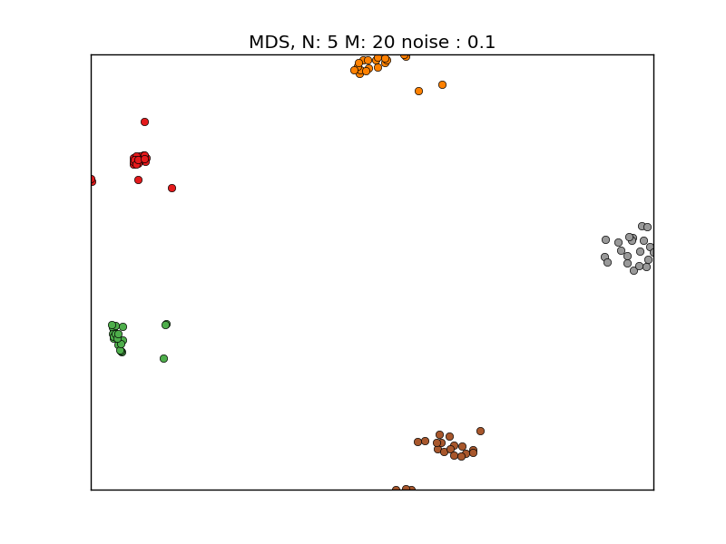
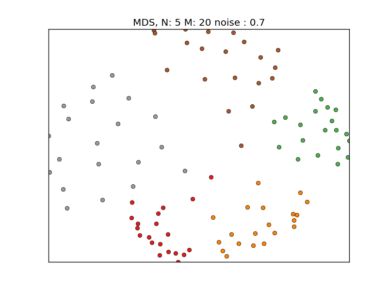
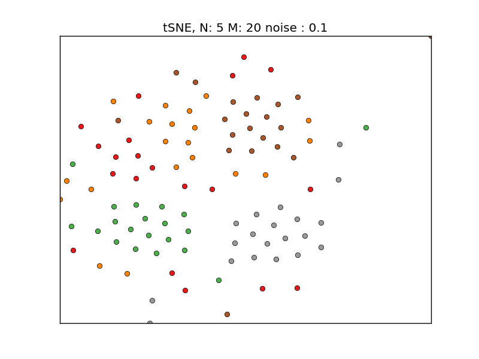
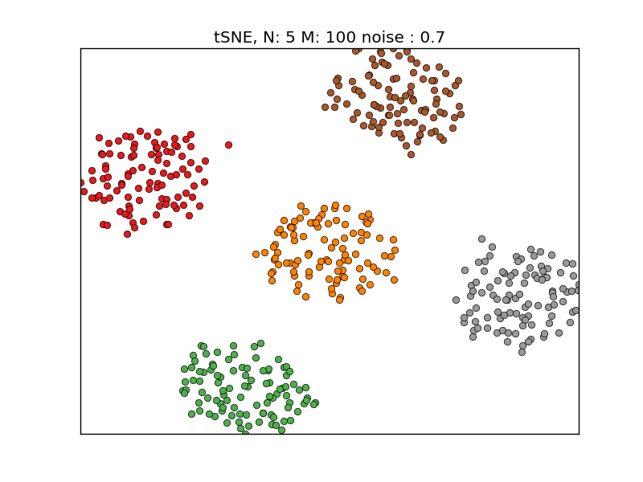

# Visualizing SDR clusters with Manifold Learning

This demo script shows that MDS and tSNEs can be used to visualize high dimensional
sparse distributed representations (SDRs).

I created *N* SDR clusters, with each cluster contains *M* SDRs. The SDRs within each cluster are created by adding varying amount of sparse noise to a template SDR. A pairwise distance matrix is constructed first. I used the percentage overlap distance metric instead of the Euclidean distance metric in all examples. 

I first consider the [multidimensional scaling (MDS) algorithm](https://en.wikipedia.org/wiki/Multidimensional_scaling), a widely used information visualization technique that
takes pair-wise distance between a set of high-dimensional data points as input.
The algorithm places these data points in a low-dimensional space such that
the distance is preserved as well as possible.

The MDS algorithm behaves robustly with varying amount of noise

We also compare MDS with [t-SNE](https://en.wikipedia.org/wiki/T-distributed_stochastic_neighbor_embedding), a nonlinear algorithms for dimensionality reduction developed by Geoffrey Hinton and Laurens van der Maaten. This algorithm works well when the number of SDRs per class is large or when the number of clusters is large. However, if both N and M are small, it doesn't behave as well as MDS. 

We compare MDS with a naive random projection algorithm. The random
projection algorithm projects a N-dimensional SDR to a 2D space with a random
N x 2 matrix. The semantic distance is preserved to some extend when noise
is low, but the performance is much worse than the MDS algorithm

